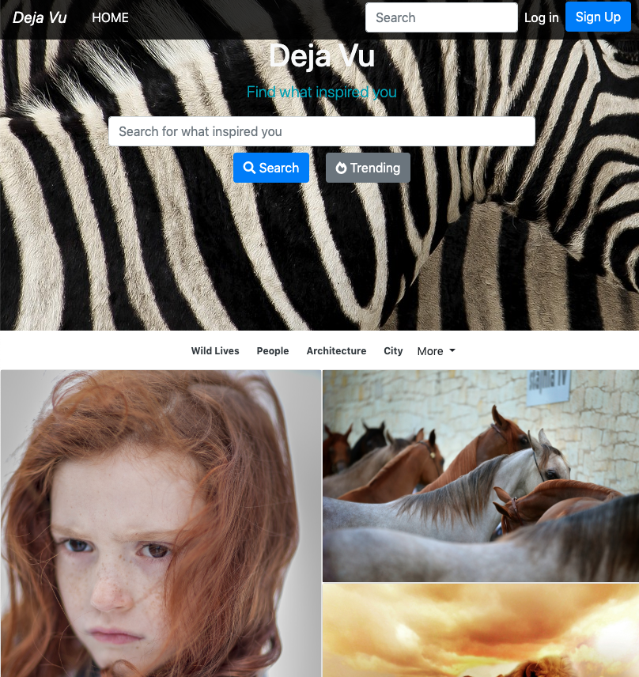

# dejavu-image-sharing-website-codeigniter


## What is DejaVu
DejaVu is an image sharing website built on the Codeigniter.

## Functions deployed 

*  __Sign Up__
*  __Log In__
*  __Modify Profile__:  Change profile on the Profile Page
*  __Forget Password / Change Password__:  Change the password by verifying personal information
*  __Search__: Search images by keywords
*  __comment__: Comment on image
*  __profile__: User Profile Page
*  __Send Email to verify the account__: An email is sent with a link to verify the account
*  __Upload Pictures__: Upload Pictures

## Getting Started
These instructions will get you a copy of the project up and running on your local machine for development and testing purposes. See deployment for notes on how to deploy the project on a live system.

### Prerequisites

The website is tested on:
* [Mysql](https://www.mysql.com/)
* [Apache](https://www.google.com)
* [PHP](https://php.net/)

You are highly recommended install [XAMPP](https://www.apachefriends.org/index.html) which installs Mysql and Apache for you at once.

### Setup
* Move the files to the ```/htdocs``` (some version is ```/html``` in apache) folder
* Set your base url in ```/application/config/config.php```
* Setup the email configuration  in ```/application/config/email.php```
* Setup the email content in ```application/models/Email_manage.php```
* Setup the databse use the file ```dejavu.sql```

### Build With
* [Codeiginiter](https://www.codeigniter.com/) - A PHP Framework
* [Mysql](https://www.mysql.com/) - Databse
* [Apache](https://www.google.com) - HTML Server
* [DropZone](https://www.dropzonejs.com/) - A PHP library for uploading
* [PHP](https://php.net/)

## Authors
* Alex Teng

## License

This project is licensed under the MIT License - see the  file for details


